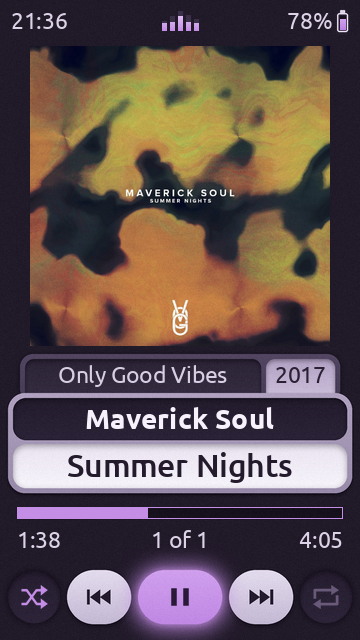
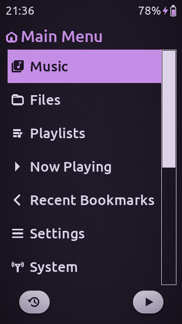
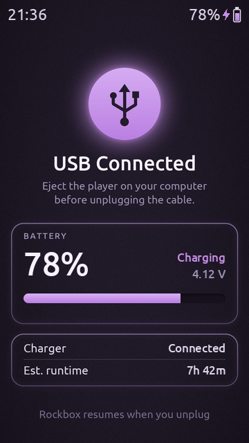

<h1 align="center">UImiz Revamped</h1>

<p align="center">
  A revamped dark purple Rockbox theme version for the <b>HIDIZS AP80 Pro Max</b> (360 × 640, touchscreen)<br>
  based on <a href="https://github.com/jgoedde/hiby-r1-rockbox-jgulmiz">JGUlmiz</a> by jgoedde and the original <b>Ulmiz</b> by Simon Rothen.
</p>

<p align="center">
  
  &nbsp;
  
  &nbsp;
  
</p>

<p align="center">
  <sub><b>Now Playing</b> · <b>Main menu</b> · <b>Charging / USB screen</b>, rendered at the AP80 Pro Max's native 360 × 640.</sub>
</p>

---

## Features

- **Ulmiz-style Now Playing:** big album art, album / year tabs that flow into the panel below, an artist / title panel, a thin progress bar and light round transport buttons. The play button has a soft purple glow.
- **Dark purple and pastel purple:** a deep purple background (`#211a29`) with a pastel purple (`#c58ee6`) accent on the progress bar, the play button, the menu selection bar, titles and icons.
- **Live mini visualizer:** five tiny bars in the Now Playing status bar move smoothly with the music.
- **Clean status bar:** the clock is on the left, the visualizer in the centre and the battery on the right. Everything has 12 px side margins and sits on the same centre line.
- **Battery icon:** a white outline with a pastel purple fill that empties smoothly. A purple lightning bolt appears while charging.
- **Custom charging / USB screen:** a glowing USB icon, a large battery percentage, a level bar, the charging state, the battery voltage, the charger status and the estimated runtime.
- **Made for touch:** long-press the top of the album art to open the file browser (the lower half opens the playlist), tap the progress bar to seek and tap the round buttons to control playback. In the status bar, tap the clock for the main menu, the visualizer for the quick screen and the battery for the context menu.
- **Sharp at native resolution:** every bitmap was redrawn with anti-aliasing at 360 × 640, and the fonts are Ubuntu, converted at the right sizes.

## Installation

1. Download this repository (green **Code** button, then **Download ZIP**) or the zip from the [Releases](../../releases) page, and **extract** it.
2. Copy the `.rockbox` folder to the root of the player's storage and **merge** it with the existing one.
3. On the player, open **Settings → Theme Settings → Browse Theme Files → UImiz Revamped**.

> **Windows:** extract the zip first instead of dragging files straight out of the zip window, and safely eject the player afterwards. If you get *access denied*, run *Properties → Tools → Check* on the player's drive.

<details>
<summary>Files installed</summary>

```
.rockbox/
├── themes/UImiz Revamped.cfg
├── wps/UImiz Revamped.wps          Now Playing screen
├── wps/UImiz Revamped.sbs          menu status bar, title and USB screen
├── wps/UImiz Revamped/             backgrounds, buttons and other bitmaps
├── icons/UImiz Revamped icons.bmp  menu icons
├── icons/UImiz Revamped viewers.bmp
└── fonts/                          Ubuntu 16, 20, 27, 34, 38, 56 and 180
```
</details>

## What I changed from JGUlmiz

JGUlmiz was made for the HiBy R1 (480 × 800) with an orange, Material-style look. UImiz Revamped is a full port and redesign for the AP80 Pro Max:

| | JGUlmiz (HiBy R1) | UImiz Revamped (AP80 Pro Max) |
|---|---|---|
| **Resolution** | 480 × 800 | **360 × 640**: every viewport, touch area, bitmap and font was rescaled and the screen re-padded, so the whole display is used with no empty space at the bottom |
| **Colours** | Orange / yellow accent | **Pastel purple** accent on a **darker purple** background, for Now Playing and the menus |
| **Now Playing** | JG Material layout | Rebuilt to look like the **original Ulmiz**: album / year tabs that flow into the panel below, artist / title panel with clear margins at both screen edges, outlined progress bar and light round buttons |
| **Play button** | Orange glow | The same glowing play button, recoloured purple |
| **Status bar** | Speaker icon and volume in dB | Clock on the left, **5-bar live visualizer** in the centre, battery on the right, all aligned with equal margins |
| **Battery** | Solid icon | **White outline with a pastel purple fill**, plus a charging bolt |
| **Menus** | Orange selection bar | **Pastel purple** selection bar, title and title icon on the dark purple backdrop |
| **USB / charging** | Rockbox's default USB logo | A **custom charging screen** with battery percentage, a level bar, voltage, charger status and runtime |
| **Buttons** | Original icons at R1 size | Shuffle, play/pause and repeat redrawn at the new size, with a frame for every state |

Notes:

- The visualizer is only on Now Playing. In menus Rockbox redraws the status bar only about once a second, which is too slow for a smooth animation.
- Rockbox themes can read only the left and right peak levels, so the five bars alternate between the two channels. It is not a real frequency spectrum.
- Both skins pass Rockbox's `checkwps` built for the `hidizsap80max` target.

## Credits

- **Simon Rothen** (rothen@gmx.net) designed the original **Ulmiz** Rockbox theme, the basis of this design.
- **jgoedde** made **[JGUlmiz](https://github.com/jgoedde/hiby-r1-rockbox-jgulmiz)**, the Material Design 3 port of Ulmiz for the HiBy R1 that this port started from.
- The menu iconset comes from the **advaitapod** theme vector files, via Ulmiz / JGUlmiz.
- The original repeat and shuffle icons were derived from the **GNOME Shell High Contrast** icons.
- The fonts are **[Ubuntu](https://design.ubuntu.com/font)** by Dalton Maag, under the Ubuntu Font Licence 1.0.
- **[Rockbox](https://www.rockbox.org)** is the open-source firmware this theme is made for.
- The album art in the preview is *Summer Nights* by **Maverick Soul**, released on **Only Good Vibes** (2017). It is shown for illustration only and is not part of the theme.

## License

Like Ulmiz and JGUlmiz, this theme is released under **[CC BY-SA 3.0](https://creativecommons.org/licenses/by-sa/3.0/)**. You may share and adapt it, as long as you credit the original authors and share your changes under the same licence. The Ubuntu fonts keep their own licence. See [LICENSE](LICENSE).
